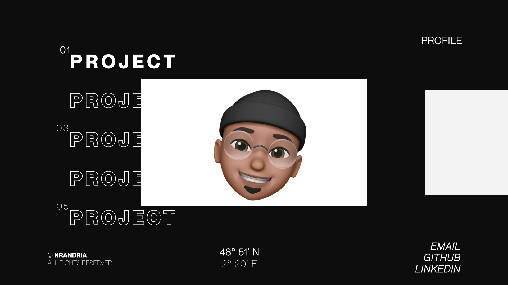

# Portfolio v2.0 - OFFLINE [WIP]

## Installation

Clone this repository and in the project directory you can run

### `yarn install`

Then the following command

### `yarn run dev`

Runs the app in the development mode.
Open [http://localhost:1234](http://localhost:1234) to view it in the browser.

## Author

- [BABAK0T0](https://www.github.com/BABAK0T0)

## License

This project is open source and available under the [MIT License](LICENSE).
